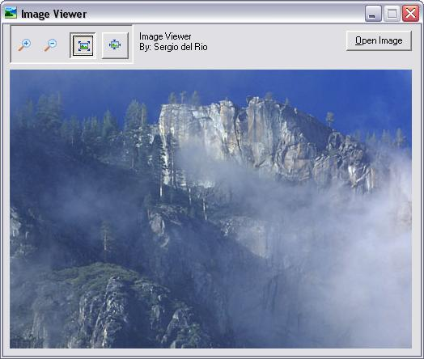



## \[ An Image Viewer\]

### Description

This Image Viewer shows the image you choose, you can make Zoom In and Zoom Out. Also you can stretch the image. Please leve your comments and vote :)
 
### More Info
 

             |
---                |---
**Submitted On**   |2003-08-11 17:32:06
**By**             |[Sergio del Rio](https://github.com/Planet-Source-Code/PSCIndex/blob/master/ByAuthor/sergio-del-rio.md)
**Level**          |Beginner
**User Rating**    |3.5 (80 globes from 23 users)
**Compatibility**  |VB 3\.0, VB 4\.0 \(16\-bit\), VB 4\.0 \(32\-bit\), VB 5\.0, VB 6\.0
**Category**       |[Graphics](https://github.com/Planet-Source-Code/PSCIndex/blob/master/ByCategory/graphics__1-46.md)
**World**          |[Visual Basic](https://github.com/Planet-Source-Code/PSCIndex/blob/master/ByWorld/visual-basic.md)
**Archive File**   |[\[\_Image\_Vi1628058112003\.zip](https://github.com/Planet-Source-Code/sergio-del-rio-an-image-viewer__1-47623/archive/master.zip)

